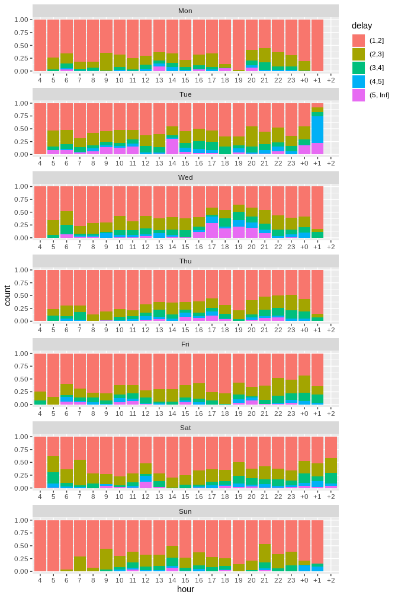

VBZ Delays Analysis
================
Mirai Solutions
2019-09-24 09:54:34

``` r
# load packages
library(dplyr)
library(vroom)
library(ggplot2)
# to save time, set to FALSE if data have been already processed
process_data <- TRUE
```

## Introduction

For each line in the Zurich public network system (VBZ), expected and
actual arrival and departure times are available for each connection
between two stations. Data are provided on a weekly basis as CSV files

  - Data: <https://data.stadt-zuerich.ch/dataset/vbz_fahrzeiten_ogd>
  - Names translation:
    <https://github.com/OpenDataDayZurich2016/translations/blob/master/Translation_Data_Attributes.pdf>

## Data handling

Weekly data and corresponding resource
IDs:

``` r
base_url <- "https://data.stadt-zuerich.ch/dataset/vbz_fahrzeiten_ogd/resource"
vbz_resources <- c(
  "20190714_20190720" = "9beb05c6-0153-4ffa-a928-8ff899bf5f1c",
  "20190721_20190727" = "7883fd6e-e8f3-4ce4-82df-4944baa01a5b",
  "20190728_20190803" = "5bec146e-ba16-4a6a-8f6b-44e4ed14bdb9",
  "20190804_20190810" = "afdb312d-2855-4437-a8cd-f1c28dd97a79"
)
```

### Download data

Data are downloaded if not already available

``` r
raw_data_dir <- "data-raw"
dir.create(raw_data_dir)
## Warning in dir.create(raw_data_dir): 'data-raw' already exists
lapply(names(vbz_resources), function(x) {
  data_file <- sprintf("fahrzeiten_soll_ist_%s.csv", x)
  path <- file.path("data-raw", data_file)
  if (file.exists(path)) {
    message("skip download of ", path)
  } else {
    download.file(
      paste(base_url, vbz_resources[[x]], "download", data_file, sep = "/"),
      destfile = path
    )
    message("downloaded ", path)
  }
}) %>% invisible()
## skip download of data-raw/fahrzeiten_soll_ist_20190714_20190720.csv
## skip download of data-raw/fahrzeiten_soll_ist_20190721_20190727.csv
## skip download of data-raw/fahrzeiten_soll_ist_20190728_20190803.csv
## skip download of data-raw/fahrzeiten_soll_ist_20190804_20190810.csv
```

### Read all data

Load and transform data with package
[**vroom**](https://vroom.r-lib.org/).

``` r
files <- file.path(
  raw_data_dir, 
  sprintf("fahrzeiten_soll_ist_%s.csv", names(vbz_resources))            
)
cols_types <- vroom::cols(
  betriebsdatum = vroom::col_date("%d.%m.%y"),
  linie = "i" # integer
)
data <- vroom::vroom(
  files,
  col_types = cols_types, altrep_opts = FALSE,
  col_select = c(
    line = linie,
    date = betriebsdatum,
    scheduled_departure = dplyr::matches("soll_ab_von"),
    actual_departure = dplyr::matches("ist_ab_von"),
    scheduled_arrival = dplyr::matches("soll_an_nach"),
    actual_arrival = dplyr::matches("ist_an_nach")
  )
)

data
## # A tibble: 5,681,118 x 6
##     line date       scheduled_depar… actual_departure scheduled_arriv…
##    <int> <date>                <dbl>            <dbl>            <dbl>
##  1    10 2019-07-14            18390            18333            18468
##  2    10 2019-07-14            20190            20192            20268
##  3    10 2019-07-14            21090            21103            21168
##  4    10 2019-07-14            21990            22063            22068
##  5    10 2019-07-14            22890            22883            22968
##  6    10 2019-07-14            23790            23690            23868
##  7    10 2019-07-14            24690            24733            24768
##  8    10 2019-07-14            25590            25584            25668
##  9    10 2019-07-14            26490            26473            26568
## 10    10 2019-07-14            27390            27436            27468
## # … with 5,681,108 more rows, and 1 more variable: actual_arrival <dbl>
```

### Line data manipulation

  - Keep only tram lines (number \< 30).
  - Extract the weekday.
  - Define the hour as the scheduled departure time (in hours) from the
    midnight of the operating day. This implies that time after the next
    midnight but before the next operating day (4AM) is assigned an hour
    \> 24.

<!-- end list -->

``` r
data <- data %>%
  filter(line < 30) %>%
  mutate(
    weekday = lubridate::wday(
      date, label = TRUE, 
      locale = "en_US.UTF-8", week_start = 1
    ),
    hour = (scheduled_departure/3600),
    hour = ifelse(hour < 4, hour + 24, hour)
  ) %>% 
  select(grep("arr|dep", names(.), invert = TRUE, value = TRUE), everything())

data
## # A tibble: 2,623,464 x 8
##     line date       weekday  hour scheduled_depar… actual_departure
##    <int> <date>     <ord>   <dbl>            <dbl>            <dbl>
##  1    10 2019-07-14 Sun      5.11            18390            18333
##  2    10 2019-07-14 Sun      5.61            20190            20192
##  3    10 2019-07-14 Sun      5.86            21090            21103
##  4    10 2019-07-14 Sun      6.11            21990            22063
##  5    10 2019-07-14 Sun      6.36            22890            22883
##  6    10 2019-07-14 Sun      6.61            23790            23690
##  7    10 2019-07-14 Sun      6.86            24690            24733
##  8    10 2019-07-14 Sun      7.11            25590            25584
##  9    10 2019-07-14 Sun      7.36            26490            26473
## 10    10 2019-07-14 Sun      7.61            27390            27436
## # … with 2,623,454 more rows, and 2 more variables:
## #   scheduled_arrival <dbl>, actual_arrival <dbl>
```

### Save data by line

``` r
line_data_dir <- "line-data"
dir.create(line_data_dir)
## Warning in dir.create(line_data_dir): 'line-data' already exists
lapply(unique(data$line), function(l) {
  line_rds <- file.path(line_data_dir, sprintf("line-%d.rds", l))
  data %>%
    filter(line == l) %>%
    saveRDS(file = line_rds)
  message("saved ", line_rds)
}) %>% invisible()
## saved line-data/line-10.rds
## saved line-data/line-12.rds
## saved line-data/line-9.rds
## saved line-data/line-14.rds
## saved line-data/line-3.rds
## saved line-data/line-5.rds
## saved line-data/line-11.rds
## saved line-data/line-8.rds
## saved line-data/line-2.rds
## saved line-data/line-4.rds
## saved line-data/line-13.rds
## saved line-data/line-17.rds
## saved line-data/line-6.rds
## saved line-data/line-15.rds
## saved line-data/line-7.rds
```

## Analysis

### Load line data

Select the line and read departure and arrival data

``` r
line <- 11
line_file <- file.path("line-data", sprintf("line-%d.rds", line))
data <- readRDS(line_file)
data
## # A tibble: 254,103 x 8
##     line date       weekday  hour scheduled_depar… actual_departure
##    <int> <date>     <ord>   <dbl>            <dbl>            <dbl>
##  1    11 2019-07-16 Tue      25.1             3960             3943
##  2    11 2019-07-17 Wed      25.1             3960             3965
##  3    11 2019-07-18 Thu      25.1             3960             3935
##  4    11 2019-07-19 Fri      24.9             3360             3489
##  5    11 2019-07-19 Fri      25.1             3960             4034
##  6    11 2019-07-20 Sat      24.9             3360             3401
##  7    11 2019-07-20 Sat      25.1             3960             4015
##  8    11 2019-07-14 Sun      25.1             3960             4033
##  9    11 2019-07-15 Mon      25.1             3960             3954
## 10    11 2019-07-17 Wed      24.7             2412             2414
## # … with 254,093 more rows, and 2 more variables: scheduled_arrival <dbl>,
## #   actual_arrival <dbl>
```

### Analysis of delays for line 11

#### Delays by hour for each weekday

Compute delays in minutes as the mean of departure and arrival delays,
and compute delay counts by hour for each weekday

``` r
delays <- data %>%
  mutate(
    delay = ((actual_departure - scheduled_departure) +
               (actual_arrival - scheduled_arrival)) / 2 / 60
  ) %>% 
  group_by(
    weekday,
    hour = cut(hour, 0:48, labels = ifelse(0:47 < 24, 0:47, paste0("+", floor(0:47) - 24))),
    delay = cut(delay, c(-Inf, 1:5, Inf))
  ) %>% 
  summarize(count = n())

delays
## # A tibble: 801 x 4
## # Groups:   weekday, hour [155]
##    weekday hour  delay    count
##    <ord>   <fct> <fct>    <int>
##  1 Mon     4     (-Inf,1]    60
##  2 Mon     4     (1,2]        4
##  3 Mon     5     (-Inf,1]  1069
##  4 Mon     5     (1,2]      140
##  5 Mon     5     (2,3]       46
##  6 Mon     5     (3,4]        5
##  7 Mon     6     (-Inf,1]  1650
##  8 Mon     6     (1,2]      379
##  9 Mon     6     (2,3]      119
## 10 Mon     6     (3,4]       51
## # … with 791 more rows
```

#### Visualize results

Barplot of normalized delay counts by hour for each weekday, conditional
on delays of at least 1 minute

``` r
delays %>% 
  filter(delay != "(-Inf,1]") %>%
  ggplot(aes(x = hour, y = count)) +
  geom_col(aes(fill = delay), position = "fill") +
  lemon::facet_rep_wrap(~weekday, ncol = 1, repeat.tick.labels = TRUE) +
  theme(legend.justification = "top")
```

<!-- -->
